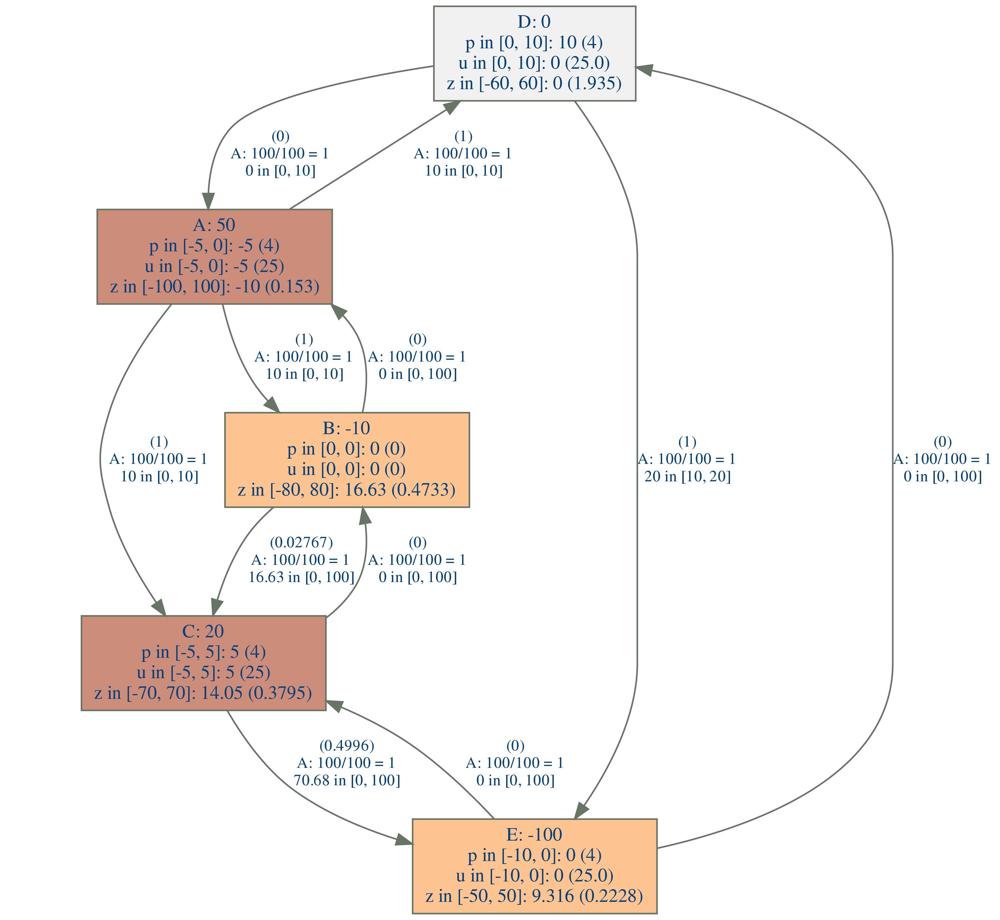
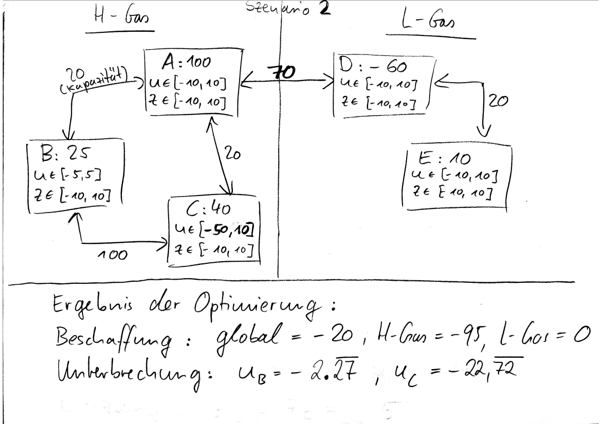

# MFT Stufe 1 und Stufe 2

## Stufe 1

### Aufruf
#### Berechnung eines Szenarios
    ruby doIt.rb verzeichnis_daten_erste_stufe/dateiname_daten_erste_stufe_ohne_dateinamenerweiterung
#### Beispiel
##### Berechnung des Szenarios hs_111
    ruby doIt.rb hs_111/hs_111
#### Berechnung aller Szenarien und Kopieren der Ergebnis-pngs nach Stufe1/Tests
    ruby tests.rb

Achtung: damit tests.rb für jedes Szenario funktioniert muss die Zimpl-Datei den gleichen Namen haben wie ihr übergeordnetes Verzeichnis, also z.B. Stufe1/hs_111/hs_111.zpl

### Voraussetzungen:
[ruby](https://www.ruby-lang.org/en/), [graphviz](https://www.graphviz.org/), [scip](https://scip.zib.de/index.php#download) und [zimpl](https://zimpl.zib.de/) müssen im Pfad sein. ruby, graphviz und zimpl sind beispielsweise in den Ubuntu-Paketquellen enthalten (sudo apt install zimpl).

### Ausgabe:
Insbesondere eine png-Datei, die die Ergebnisse visualisiert.

## Stufe 2

### Aufruf
#### Berechnung eines Szenarios
    ruby doIt.rb verzeichnis_daten_stufe21/dateiname_daten_stufe21_stufe_ohne_dateinamenerweiterung verzeichnis_daten_stufe22/dateiname_daten_stufe22_stufe_ohne_dateinamenerweiterung
Die Daten von Stufe 2.1 und von Stufe 2.2 unterscheiden sich nur in den Kantenkapazitäten. Für Stufe 2.2 werden bis auf die Überspeisungen zwischen den Gasbeschaffenheitszonen alle Kanten mit einer nicht restriktiven Kapazität versehen.

#### Beispiel
##### Berechnung des Szenarios "Szenario1"
    ruby doIt.rb Szenario1/ug_21 Szenario1/ug_22

### Ausgabe:
Zu beschaffende Regelenergie global und gasbeschaffenheitsspezifisch und erforderliche Unterbrechungen und Kürzungen in den NBZ.

### Erläuterungen:
Die Sufe 2 arbeitet in drei Schritten:

2.1. Berechnung der globalen und der gasbeschaffenheitsspezifischen Regelenergie, sowie Fehlmengen, die in den NBZ verbleiben müssen, da sie nicht mit globaler oder gasbeschaffenheitsspezifischer Regelenergie abgewickelt werden können

2.2. Berechnung der Unterbrechungs- und Kürzungsmengen je Gasbeschaffenheitszone

2.3. Berechnung der gleichmäßigen Verteilung von Kürzung und Unterbrechung je Gasbeschaffenheitszone
#### Rechenbeispiele
Gedanklich sollen die unten in den Bildern dargestellten Werte der Zustand NACH der Berechnung von Stufe 1 sein. Die Kapazitäten sind die Kapazitäten für Stufe 2, die sich aus den Kapazitäten und den Flüssen aus Stufe 1 ergeben. Die Planwerte und das Puffern aus Stufe 1 sind also schon verrechnet.
##### Szenario 1
Beobachtung 1: Bei B und C zusammen müssen 25 Einheiten durch Unterbrechung und Kürzung "weg", da sonst die Kapazitäten zu A in manchen Szenarien nicht ausreichen, um die Bilanz auszugleichen.

Beobachtung 2: Zwischen B und C gibt es keinen Engpass.

Beobachtugn 3: Das Unterbrechungspotenzial bei B und C ist in Summe kleiner als -25 Einheiten, nämlich -15 Einheiten. Diese werden also komplett unterbrochen. Die verbleibenden 10 Einheiten müssen also gekürzt werden. Da das Kürzungspotenzial bei beiden gleich ist, werden bei B und bei C folglich jeweils -5 Einheiten gekürzt.

##### Szenario 2
Beobachtung 1: Es hat sich im Vergleich zu Szenario 1 lediglich das Entryunterbrechungspotenzial bei C geändert von -10 auf -50.

Beobachtugn 2: Das Unterbrechungspotenzial bei B und bei C ist nun ausreichend, um die erforderlichen 25 Einheiten darzustellen.

Beobachtung 3: Das Unterbrechungspotenzial bei C ist 10 mal höher, als das bei B. Daher wird bei C auch die 10-fache Menge unterbrochen: 2.27... * 10 = 22.72...

