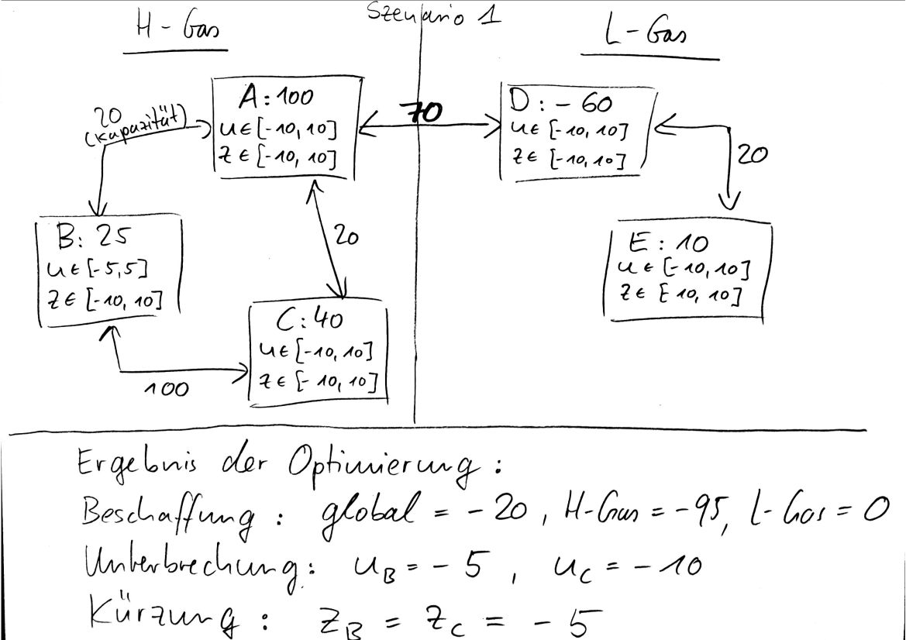

# MFT Stufe 1 und Stufe 2

## Stufe 1

### Aufruf
#### Berechnung eines Szenarios
    ruby doIt.rb verzeichnis_daten_erste_stufe/dateiname_daten_erste_stufe_ohne_dateinamenerweiterung
#### Beispiel
##### Berechnung des Szenarios hs_111
    ruby doIt.rb hs_111/hs_111
#### Berechnung aller Szenarien und Kopieren der Ergebnis-pngs nach Stufe1/Tests
    ruby tests.rb

Achtung: damit tests.rb für jedes Szenario funktioniert muss die Zimpl-Datei den gleichen Namen haben wie ihr übergeordnetes Verzeichnis, also z.B. Stufe1/hs_111/hs_111.zpl

### Voraussetzungen:
[ruby](https://www.ruby-lang.org/en/), [graphviz](https://www.graphviz.org/), [scip](https://scip.zib.de/index.php#download) und [zimpl](https://zimpl.zib.de/) müssen im Pfad sein. ruby, graphviz und zimpl sind beispielsweise in den Ubuntu-Paketquellen enthalten (sudo apt install zimpl).

### Ausgabe:
Insbesondere eine png-Datei, die die Ergebnisse visualisiert.

## Stufe 2

### Aufruf
#### Berechnung eines Szenarios
    ruby doIt.rb verzeichnis_daten_stufe21/dateiname_daten_stufe21_stufe_ohne_dateinamenerweiterung verzeichnis_daten_stufe22/dateiname_daten_stufe22_stufe_ohne_dateinamenerweiterung
Die Daten von Stufe 2.1 und von Stufe 2.2 unterscheiden sich nur in den Kantenkapazitäten. Für Stufe 2.2 werden bis auf die Überspeisungen zwischen den Gasbeschaffenheitszonen alle Kanten mit einer nicht restriktiven Kapazität versehen.

#### Beispiel
##### Berechnung des Szenarios "Szenario1"
    ruby doIt.rb Szenario1/ug_21 Szenario1/ug_22

### Ausgabe:
Zu beschaffende Regelenergie global und gasbeschaffenheitsspezifisch und erforderliche Unterbrechungen und Kürzungen in den NBZ.

